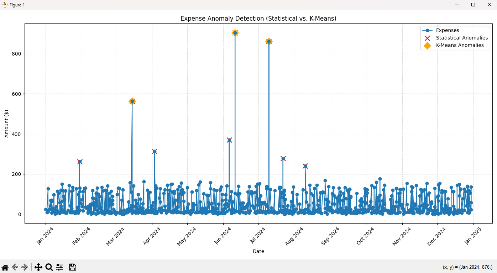

# Expense Anomaly Detector

## Problem Statement
Managing personal finances can be tricky, unusual, or unexpectedly high expenses often go unnoticed until it’s too late.  
We need a way to automatically **detect anomalies in daily spending** to help people take control of their expenses.

---

## Solution
This project applies **algorithmic anomaly detection** to personal expense data.

We use two approaches:
1. **Statistical Rule** → An expense is flagged if it is above `mean + 2 × std deviation`.  
2. **AI/ML (K-Means Clustering)** → Expenses are grouped into clusters (low, medium, high). The cluster with the **highest average spending** is treated as anomalous.  

This combination allows us to detect **both obvious and hidden spending anomalies**.

---

## Features
- Synthetic dataset generator  
- Dual anomaly detection:
  - **Statistical threshold**  
  - **K-Means clustering (AI)**  
- Visual anomaly highlighting with **Matplotlib**.  


##  Installation & Running
### 1. Clone the repo
### 2. Install dependencies
    pip install -r requirements.txt
### 3. Run the program 

https://www.kaggle.com/datasets/ealaxi/paysim1/data


## Example Output
```
Statistical anomalies (sample):
          date       category  amount  stat_anomaly  cluster  kmeans_anomaly
69  2024-01-30       Shopping  261.60          True        0           False
175 2024-03-15       Shopping  563.44          True        1            True
221 2024-04-03       Shopping  313.84          True        0           False
377 2024-06-06  Entertainment  370.40          True        0           False
390 2024-06-11          Bills  904.75          True        1            True

K-Means anomalies (sample):
          date  category  amount  stat_anomaly  cluster  kmeans_anomaly
175 2024-03-15  Shopping  563.44          True        1            True
390 2024-06-11     Bills  904.75          True        1            True
455 2024-07-10  Shopping  862.02          True        1            True
```

## Graph

- Blue line → Normal expenses over time
- Red ❌ → Statistical anomalies
- Orange 🔶 → K-Means anomalies

